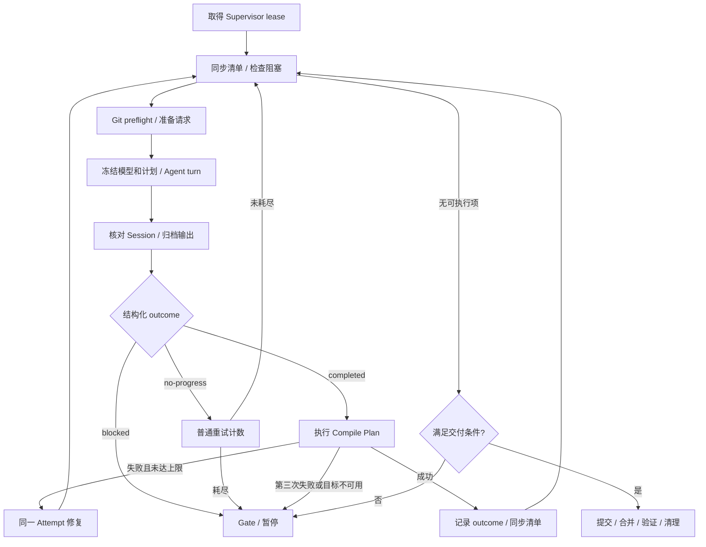

# AIW 自动编码流程

本文按当前源码说明自动编码入口和执行边界。详细操作及故障处理见
[Supervise 使用指南](supervise.md)。

## 1. 当前可用范围

`aiw workflow` 与 `aiw task workflow` 使用同一入口。`supervise` 是前台、单 Task、
顺序执行的循环，每轮派发一个有界 Agent turn。

**新 Task 默认仍使用 schema 9。** 源码另有 schema 10 持久化多阶段协议，需要
受管迁移、受控宿主和平台证据；普通 `supervise start` 不启用它。

| 能力 | 默认 schema 9 CLI | schema 10 受控协议 |
|---|---|---|
| 实现 | Coder、结构化 outcome、编译及有界修复 | 独立阶段、冻结输入、精确请求和结果绑定 |
| 测试 | 单独授权的 focused-test 试点 | 独立 Tester、冻结测试 manifest、受控 Runner |
| 模型 | coder Profile 快照；修复复用，不自动升级 | 按 Actor 记账，按配置中的不同模型顺序升级 |
| Stop | 停止当前 Supervisor lease | 持久保存，重启不解除 |
| 交付 | 条件满足时提交、合并父分支并清理 | 冻结计划、精确授权、受控宿主及独立清理授权 |

通用 `NextRunnerOutcome` 对 schema 10 返回 blocked，要求受控阶段适配器，禁用
旧派发；旧本地交付也被拒绝。不能通过手改 `schema_version` 启用这些能力。

## 2. 状态与职责

| 组件 | 职责 |
|---|---|
| AIW Task | 生命周期、工作区、分支、父分支和 Session 关联 |
| OpenSpec | proposal、design、spec、人工清单及完成条件 |
| Workflow Core | Work Item、Attempt、Gate、Evidence、lease 和执行事实 |
| Supervisor | 顺序调度、Session 观察、编译修复及默认路径的本地交付 |
| Session / Agent CLI | 单次模型执行的上下文、输出、事件及原生线程 |
| 受控宿主 | schema 10 执行边界、结果凭据、对账和授权副作用 |

不要手改状态文件或仅勾选清单来替代 Core 的受管状态转换。

## 3. 启动前准备

以下示例在仓库根目录运行。先安装 AIW、Git、所选 Agent CLI，并完成 CLI 认证。

```powershell
aiw init
aiw new payment-retry
aiw show payment-retry
aiw context payment-retry
```

补齐 `openspec/changes/payment-retry/` 的需求、设计和 `tasks.md`。Work Item 来自
清单，应有明确范围和完成条件。若 Requirement promotion 已生成 Task，使用现有任务。

先审阅并提交需要带入工作树的工件和代码，让父工作区干净，再运行：

```powershell
aiw wt add payment-retry
aiw workflow plan payment-retry
aiw workflow recommend-routing payment-retry
aiw wt status payment-retry
```

自动执行默认使用 `.wt/<task-id>/`；supervise 也能按默认规则准备隔离工作树。
`recommend-routing` 保存路由和 Compile Plan，可调用共享 AI provider；失败时使用
确定性默认路由。Requirement promotion 会调用该入口；已有计划时按需重新推荐。

```powershell
aiw workflow supervise payment-retry start --provider codex --model your-model
```

**默认路径满足交付条件后会提交、合并到记录的 `parent_branch`，并清理已合并工作树
和分支。** 它不自动 push、发布 PR 或 archive。

另一终端可观察或停止：

```powershell
aiw workflow supervise payment-retry status
aiw workflow report payment-retry
aiw workflow diagnose payment-retry
aiw workflow supervise payment-retry stop
```

`stop` 不证明在途 Agent 或编译进程已退出。结果未知时先核实原进程和请求，不能
立即启动第二个写入者。schema 10 的 Stop 持久保存，重新 start 不解除。

### 单步与预览

| 命令 | 实际作用 |
|---|---|
| `aiw workflow run payment-retry` | 不调用 Agent，但可能准备并持久化请求，不是纯只读 |
| `aiw workflow advance payment-retry` | 准备 Attempt-bound 请求，不调用模型 |
| `aiw workflow run payment-retry --execute` | 执行一步，不包含完整监督编译修复和自动交付循环 |
| `aiw workflow run payment-retry --execute --primary` | 显式使用主工作区，仅限 Task 已绑定主工作区 |

`--primary` 不是 supervise 参数。准备 supervise 时不要用 `advance` 或 `run` 预热
请求；让 supervise 在计划就绪后冻结请求。旧请求不会随计划文件或 CLI 模型参数
变化而更新。纯观察使用 `show`、`status`、`diagnose`、`report`。

## 4. 默认监督循环



- 初始 Git preflight 失败产生 `workspace-access` Gate，不创建新 Attempt、不消耗重试。
- Session 必须完成且有最终输出；Task、Work Item、Attempt 和 Session turn 必须匹配。
- 原始输出先归档为 execution report。普通无效 outcome 按 no-progress 处理。
- 带冻结输入的请求还校验 implementation report 的身份、输入摘要、变更引用和事实
  章节；最多补充一次报告，仍无效则进入 `report-manual-review`。
- 普通 no-progress 默认上限 3，`retry-policy` 可设为 1–5；blocked 不增加该计数。
- 连续第三次编译失败停止自动修复，即初次失败后最多两次修复 turn。编译成功清零；
  修复保留 Attempt、工作树、模型及计划。
- Agent 不自行编译或测试；Supervisor 编译器执行冻结目标，不调用模型。

缺少冻结计划或目标不可用会打开 Gate。编译按变更路径选目标，共享或无法映射的
变更回退全部计划目标。勾选清单不绕过活跃编译、阻塞或未清除的编译失败。

## 5. 模型、上下文和 Skills

```toml
[ai]
provider = "codex"
model = "your-default-model"

[ai.profiles.balanced]
provider = "codex"
model = "your-coding-model"
```

Profile 配在 `[ai.profiles.<name>]`，必须包含 provider 和 model；不完整时回退全局
`[ai]`。默认映射为 `analysis=fast`、`coder/tester=balanced`、`verifier=reasoning`。
默认监督只读取 coder。新请求保存 `AISelection`，启动覆盖在冻结时应用；恢复及
编译修复复用快照，不因重启而换模型。schema 10 另有按 Actor 记账的路由与升级服务。

执行通过 `aiw turn <task-id> --supervised` 进入 Session 和外部 Agent CLI，使用 Task
工件、所选 Work Item、handoff 及运行上下文，不进入交互式 `chat`。

Skills 提供 Agent 方法指引，不授予测试、Git 写入或生命周期权限。默认循环不会
因为安装 `tdd` 或 `code-review` 就自动运行测试或审查。schema 10 另有 Skill manifest
及冻结上下文支持，应以实际请求包含的选择为准。

监督请求的只读 Git 前缀限定到本次预检确认的工作树：

```text
git -c "safe.directory=<verified-worktree>" -C "<verified-worktree>" status
```

它不授权持久 Git 配置或 Git 写入。不要使用 `safe.directory=*` 或旧 handoff 的目录。

## 6. 验证、交付与辅助工作

默认 focused-test 是独立授权试点，计划位于
`openspec/changes/<task-id>/artifacts/verification-plan.json`。授权绑定归一化计划摘要，
选择只能引用已批准 check ID。授权缺失/过期或无法强制 `network: deny` 时，在启动
进程前停止。命令本身不授予权限：

```powershell
aiw workflow focused-test payment-retry attempt-123
```

没有 Verification Plan 时，默认 supervise 可 waived 可选 focused verification。
**waived 不等于测试通过**，也不代表完整 Tester/Runner 链路已执行。

默认本地交付要求隔离 Task 执行完成，验证为 passed/waived/not-required，且无阻塞
Gate、待处理请求、写入 lease 或投影修复。交付检查父分支，提交、合并、核实祖先
关系，再清理资源。冲突时保留原 Task 工作树作为候选，提供人工处理指引，不自动
调用 `resolving-merge-conflicts` Skill。

schema 10 的阶段为
`coder → report-validation → compile → tester → test-run → acceptance → accepted`。
它要求受控宿主、精确授权、预算及平台启用证据；Tester 使用独立 Session，Runner
执行冻结 manifest。缺隔离能力或独立断言审查则拒绝执行，不降级到普通 shell。
旧 `local-merge` 和清理路径被禁用；受控清理需要独立授权和 sealed-source 证据。

源码还支持 Verifier、Task memory、项目知识及通知相关持久事实与辅助工作。辅助
宿主需要明确配置、Task 授权和能力证据，缺失时记录等待/host gap。它运行有界队列，
不是常驻调度器；下列维护命令不启用 schema 10：

```powershell
aiw workflow auxiliary inventory
aiw workflow knowledge show payment-retry
```

## 7. 持久化与恢复

| 路径 | 内容 |
|---|---|
| `.ai/tasks/<task-id>/task.toml` | 规范 Task 元数据；兼容读取旧 OpenSpec 目录内元数据 |
| `.ai/tasks/<task-id>/state.json`、`events.jsonl` | Workflow 状态、事件、请求、Gate 和 lease |
| `.ai/tasks/<task-id>/routing-plan.json` | 路由与 Compile Plan |
| `.ai/tasks/<task-id>/artifacts/handoff.md` | 当前交接 |
| `.ai/tasks/<task-id>/artifacts/compiler-repair.md` | 编译修复指引 |
| `.ai/tasks/<task-id>/compile-diagnostics/` | 编译命令、退出码和诊断 |
| `.ai/tasks/<task-id>/reports/latest-failure.md` | 最近未解决失败的原因、证据和下一步 |
| `.ai/sessions/<session-id>/` | Session 状态、事件、提示词和 outputs |
| `openspec/changes/<task-id>/tasks.md` | 人工清单和 Core 生成投影 |

```powershell
aiw workflow diagnose payment-retry
aiw workflow report payment-retry
# 仅在诊断要求恢复事件或修复投影时使用：
aiw workflow recover payment-retry
aiw workflow repair payment-retry
```

`recover` 补齐待恢复事件，`repair` 修复投影；都不重跑 Agent，不自动消除业务 Gate。
schema 9 的 blocked 项需处理相关 Gate 后显式 `reopen`。

`start` 仅从有效且 ID 匹配的 Task 元数据初始化缺失的非活跃投影，不能恢复丢失的
Attempt 历史。change 目录或 migration marker 不能替代元数据，`status` 不做初始化。

schema 10 的 Stop、预算和已用授权跨重启保留；旧预算不能重建时保持未知，要求
人工决策。结果未知先通过原执行器只读对账，保留请求和写入权；已保存结果可消费
而无需重跑。不要删除状态文件、清零计数或回退 schema 来绕开暂停。

## 8. TODO 与 Verification

- [x] 对照命令解析、默认 Runner、Supervisor、Session 和编译修复路径更新说明。
- [x] 区分默认 schema 9 与需受控宿主启用的 schema 10。
- [x] 更新交付副作用、持久 Stop、报告校验和辅助工作边界。

实现入口：`internal/commands/task/workflow_commands.go`、`workflow_supervisor.go`；
默认编排：`internal/workflow/execution/supervisor.go`、`session.go`、`compile.go`、
`delivery.go`；协议边界：`internal/workflow/execution_protocol.go`、`runner.go`、
`execution/stages.go`、`execution/verification_host.go`、`execution/local_delivery.go`。

%% 本次文档更新仅静态核对源码，未运行 Agent、编译、测试、真实 Git 交付或协议迁移。
