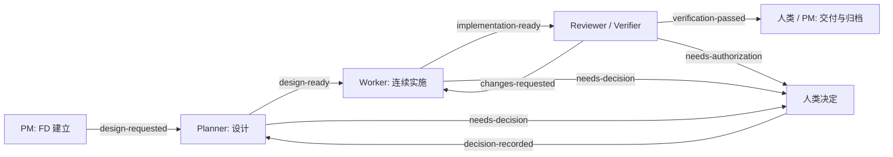

# FD-001：事件驱动的 FD 工作流

**Status:** Complete
**Revision:** 6
**Priority:** High  
**Impact:** 以可读的 FD 和角色交接完成开发，逐步退出 Supervisor 与强制 Workflow Core 执行路径。

## Problem

当前受管流程把 Task、FD、Workflow Core、Supervisor、Attempt、Gate、验证产物与 Git 交付串在一起。Supervisor 的恢复和验收约束使普通开发工作难以连续推进，使用和维护成本已超过预期。用户已决定废弃 Supervisor，可以接受本地 Git commit，并希望采用不同角色处理不同环节、通过事件交接。

独立 FD 已有编号、索引、状态和归档操作；受管 FD 则拥有较完整的决策、工作项和验收内容，但以 Task ID 命名并依赖 Core 映射。两套规则并存会造成身份与状态重复。

## Goals

1. 使用 `FD-XXX` 作为开发工作的稳定身份；一个 FD 从设计到归档均可独立存在。
2. 用 PM、Planner、Worker、Reviewer/Verifier 的明确交付物和事件交接推进工作；角色可以使用不同 Agent 会话，按 FD 隔离上下文。
3. FD 文件是设计、工作项、当前状态和验收结果的主记录；`FEATURE_INDEX.md` 仅用于查找。
4. 一个 FD 内默认按依赖顺序连续处理所有就绪工作项；不同 FD 可以在隔离工作区并行。
5. 支持中断后恢复，不重复派发结果未知的工作，也不伪造验证证据。
6. 允许按工作流规则创建本地 Git commit；push、合并、发布与部署分别处理。

## Non-goals

- 不保留 Supervisor 作为新工作流的必经执行器，也不复刻其 Attempt、lease、重试与验收状态机。
- 不把 OpenSpec change 作为 FD、实现或稳定规格更新的默认前提；只有用户明确要求时创建 change。
- 不自动运行当前仓库规则尚未授权的测试、最终构建、网络操作或部署。
- 不在第一阶段删除旧 Task、Core 数据或历史记录。

## Decisions and rationale

### 1. 独立 FD 是主记录

新 FD 使用 `docs/features/FD-XXX_SLUG.md`；文件中包含问题、候选方案、选择理由、范围、验收条件、编号工作项、验证计划、证据和未决 `%%` 注释。FD 编号不得复用，工作项编号在开始实施后保持稳定。Issue 可以链接 FD；不要求先创建 AIW Task。旧 Task 保留原引用，迁移时添加 FD 关联，不静默改写已完成项。

理由：编号和可读文件使 Planner 与 Worker 能跨会话交接，且无需先创建运行时状态。保留受管 FD 中较完整的决策和验收内容，避免独立模板过于简略。

### 2. 事件来自明确的阶段交付

事件由 FD 创建、设计就绪、工作项实施完成、核查通过/失败、需要人类决策、关闭等明确操作产生。保存文件、编辑文字或普通 Git commit 本身不触发 Agent 派发。事件至少包含 `fd_id`、`event_type`、`fd_revision`、`producer`、`artifact_ref` 和唯一 `event_id`；接手角色只读取对应 FD 版本和产物。事件是交接记录，不是第二套业务状态来源。

理由：显式交付减少文件监听误触发。`fd_revision` 与 `event_id` 允许在重试时识别旧事件和重复事件。

### 3. 轻量派发与恢复

一个 FD 同时只有一个可写角色会话。派发器在交接前记录事件及目标会话，收到结果后记录产物引用并更新 FD。相同事件只消费一次；结果未知时先核对原会话和工作区，不能仅因超时再派发写入角色。不同 FD 可并行，写入范围冲突时使用独立 worktree 或暂停其中一方。

首版由显式 FD 阶段操作产生事件；派发器在同一次操作中自动启动接手角色，不要求用户逐个发起角色会话，也不需要常驻守护进程。若当前宿主无法启动角色，则保存待派发事件，并由下一次 `resume` 继续。最小持久记录放在 `.ai/fd/<fd-id>/`，只保存派发、会话和回执；FD 的状态与工作项进度仍以 Markdown 为准。恢复命令根据 FD 与未结清回执给出下一步，不推断未知执行已经成功。

### 4. 角色契约

| 角色 | 输入 | 输出与交接条件 |
| --- | --- | --- |
| PM | 用户请求、Issue、FD 索引 | 建立或整理 FD；确定优先级、范围和来源；将需要设计的 FD 交给 Planner |
| Planner | FD、Issue 事实、代码与相关稳定规格 | 比较方案，写明决定、验收和编号工作项；消除会改变行为的 `%%` 问题后发出 `design-ready` |
| Worker | 已就绪 FD 和对应工作项 | 连续实现所有就绪项，记录修改、证据及阻塞；代码完成后发出 `implementation-ready` |
| Reviewer/Verifier | FD、实现差异、实际验证证据 | 在独立会话核查范围、正确性和证据；通过时发出 `verification-passed`，否则发出带具体问题的 `changes-requested` |
| 人类 | 需要业务决定或额外授权的记录 | 决定范围、授权、关闭或交付；回答后从原 FD 继续 |

Reviewer/Verifier 应独立于当前 Worker 会话。角色分工不意味着每个 FD 都必须同时运行多个 Agent；普通 FD 可顺序交接，只有不同 FD 的独立工作适合并行。

### 5. 状态、验证和 Git

FD 状态采用 `Planned → Design → Open → In Progress → Pending Verification → Complete`，并允许 `Deferred`、`Closed`。状态只有在对应交付物存在时才变更。每个工作项分别标记待办、完成或明确取消；完成标记必须对应真实的修改和证据。`Complete` 要求所有范围内工作项结清、Verification 有实际结论且未决阻塞已处理。

Worker 可以按已完成且可独立审查的工作项创建本地 commit；Reviewer/Verifier 应审查明确的提交或差异。核查发现问题后由 Worker 修复并再次交接。自动 commit 的授权边界应写入项目规则；当前仓库在规则更新前仍按 `AGENTS.md` 执行。任何阶段都不因 commit 自动 push、合并、发布、部署或归档。

验证命令遵守项目规则：静态审查为默认；代码实现后执行一次 compile-only 检查；测试及其它可执行验证只在已授权时运行。报告区分“未运行”“失败”和“通过”，不得把 Agent 自述或 FD 勾选当作运行结果。

## Event flow

返回角色由未决问题的所属阶段决定；图中的 `decision-recorded → Planner` 仅示例设计问题。事件消费者必须核对 FD 版本、阶段、产物和写入权限；不满足条件时保存诊断并停止继续派发。

## Migration and compatibility

1. 先实现 FD 编号、索引、模板与角色交接 Skill；让一个新 FD 完整走过设计、实施、核查和关闭。
2. 为新 FD 提供轻量事件记录、恢复与可选 worktree。Issue promote 改为链接 FD；不再默认创建 Task 或 OpenSpec change。
3. 调整 Implement、ask-asu、fd-workflow 和项目工作管理说明，使新 FD 路径成为默认；新流程不再调用 `wf supervise` 或要求 Core 验收产物。
4. 旧 Task 和 Core 数据保持可读，提供明确的迁移或继续旧流程路径。迁移必须保留已有 FD、工作项完成记录、证据和 Git 关联，不把旧记录伪装成新核查结果。
5. 真实 FD 验证通过后，停止公开推荐 Supervisor；再单独处理旧 CLI、Core 代码和相关稳定规格的废弃与移除。

## Files to create or modify during implementation

| Path | Purpose |
| --- | --- |
| `skills/fd-workflow/` | 合并独立与受管规则，以独立 FD 为默认入口 |
| `skills/implement/`、`skills/ask-asu/` | 按事件和角色接力，不要求 Task/Core |
| `docs/features/` | FD 模板、索引、编号文件及归档 |
| `internal/`、`cmd/`、`plugins/` 的相关 CLI 路径 | 提供最小事件交接、恢复、索引与工作区操作；具体代码位置由实现阶段按现有边界确定 |
| `docs/`、`openspec/specs/` | 更新公开说明与实际改变的稳定契约；不默认创建 OpenSpec change |

## Work items

- [x] 1.1 固定 FD 文件格式、编号和阶段交付条件；建立模板、索引及旧 FD 识别规则。
- [x] 1.2 定义事件契约和单 FD 派发/恢复行为，用一个真实 FD 验证重复事件与未知结果的处理。
- [x] 1.3 调整 PM/Planner/Worker/Reviewer Skill 与路由，使默认开发流程以 FD 为入口并连续完成就绪工作项。
- [x] 1.4 将可选工作树、会话关联和本地 commit 接入 FD 身份，保持 push/合并/发布分离。
- [x] 1.5 提供旧 Task/Core 数据的只读兼容与明确迁移路径，更新说明和稳定规格。
- [x] 1.6 用组合证据验证新 FD 的设计、实施、独立核查和归档，以及失败返回与恢复，并决定旧 Supervisor/Core 的代码移除范围。

## Acceptance

1. 不创建 Task 或 OpenSpec change，也能建立编号 FD、完成设计并交给独立 Worker 会话。
2. 一个 FD 的全部就绪工作项能连续实施；需要业务决定、额外验证授权或写入冲突时停止并保留上下文。
3. 重复事件不重复执行；结果未知时能够找到原会话或明确暂停，不产生第二个并发写入者。
4. Reviewer/Verifier 的失败记录能回到 Worker；通过记录引用实际差异与验证证据，FD 状态和索引一致。
5. 本地 commit 可以纳入工作流；未获单独授权时不自动 push、合并、发布或部署。
6. 旧 Task/Core 记录仍可查阅，新 FD 工作流不需要 Supervisor 或 `accepted-execution` 才能结束。

## Verification plan

- 静态核对 Skill、CLI 帮助、FD 模板、索引、稳定规格与事件契约的一致性。
- 对事件重复、旧版本、执行结果未知、写入冲突、验证失败返回和人工阻塞进行小范围场景验证；实际执行命令按当时项目授权规则选择。
- 用一个真实 FD 记录从建立到归档的每次角色交接、修改、验证结果和本地 commit，确认可从新会话恢复。

## Verification

- Independent Reviewer report: `docs/features/archive/FD-001/reviews/FD-001-review.md`.
  Outcome: changes requested. The Reviewer found that a pending role handoff
  can be completed without a claim or source event, and that `close Complete`
  does not bind the archived FD content to the Reviewer's event digest.
  No tests or builds were run during this review.
- Worker claimed `FD-001-000004-changes-requested` and addressed both findings:
  role completion now requires a claimed or dispatched source event, and
  Complete archive compares the current FD digest with the Reviewer's receipt.
  The changed Python sources passed compile-only inspection and `git diff --check`.
  The revised smoke scenarios are recorded but have not been run.
- Independent re-review: `docs/features/archive/FD-001/reviews/FD-001-review-r2.md` found both
  returned findings resolved by static inspection. The new negative smoke
  scenarios remain unrun; no test or build was run by the Reviewer.

## Implementation progress

%% 验证边界：2026-09-30 `python scripts/fd_smoke.py` 在临时 Git 仓库通过，覆盖 FD 创建、角色派发、同会话重复认领、第二会话拒绝、已认领事件的恢复不重派、设计与实施交接、核查退回与通过、本地 commit、worktree 和归档。角色运行器仍为脚本中的占位程序，尚未验证真实 Agent 会话的跨会话恢复。用户确认可将此负向路径证据与 FD-002 的真实角色试点合并用于 1.6 验收；两者的局限仍在下文说明。

%% 试点边界：FD-002 使用独立 Planner、Worker、Reviewer 会话，事件从 `design-requested` 经 `design-ready`、`implementation-ready` 到 `verification-passed`，并由 `aiw fd close FD-002 Complete` 归档。Reviewer 报告位于 `docs/features/archive/FD-002/reviews/FD-002-review.md`。本次真实审查未发现需要退回的问题，因此真实会话的 `changes-requested` 循环仍未发生；失败返回只有临时仓库脚本证据。FD-002 未运行针对新提示文字的运行时输出检查，也未创建本仓库 Git commit。

- 已添加 `aiw fd` 插件、FD 模板、角色 Skill、FD 使用说明与稳定规格。旧 Task/Core 命令保留可读。
- 插件通过可配置的 `AIW_FD_ROLE_RUNNER` 启动角色；未配置时保留待派发事件。当前未提供内置 Agent 运行器，需在真实 FD 试点中选定宿主适配器。
- 已做 Python 源码的 compile-only 检查。2026-09-30 运行更新后的 `python scripts/fd_smoke.py` 并通过聚焦场景；CLI 回执记录宿主会话 ID，重复认领与未知结果不自动重派。旧 Task/Core 命令未改动，迁移步骤记录于 `docs/usage/aiw-fd.md`。真实 Agent 的独立会话交接由 FD-002 试点覆盖；真实失败返回和旧数据迁移试点仍未执行，不能声称它们通过。
- 2026-09-30 的 FD-002 真实角色试点已完成设计、实施、独立核查与归档，见 `docs/features/archive/FD-002/FD-002_ACTIONABLE_FD_HANDOFF_RECOVERY_HINTS.md` 和 Reviewer 报告。Worker 的 Python compile-only 检查通过；Reviewer 未运行测试，并明确记录新提示的运行时输出尚未验证。用户接受组合证据完成 1.6。旧 Supervisor/Core 的代码移除范围本次确定为零；后续需根据迁移使用情况另立 FD，再决定具体删除范围。
- 已批准 Issue 的新 FD 关联只写在 FD 的 `Sources` 中，不改动旧 `requirement.toml` 的 Task 专用推广字段；需要反查时扫描 FD 来源。这样保留旧记录语义和较小迁移范围。

## Risks and boundaries

- 取消 Core 后，不再有其严格的跨进程租约与验收状态机；并行写入必须依赖工作区隔离和明确交接，不能仅靠 Markdown 状态。
- FD、索引与事件回执不是一个原子文件；恢复时以 FD 为主记录核对回执，不自动猜测未确认的写入结果。
- 旧稳定规格当前要求 Supervisor/Core 行为；切换实现时必须同步修订，不能只改 Skill 文案。

## Sources

- 用户本轮决定：废弃 Supervisor；可接受本地 Git commit；允许调整现有 fd-workflow；下一步设计 FD。
- [Manuel Schipper：Parallel coding agents](https://schipper.ai/posts/parallel-coding-agents/)：PM、Planner、Worker、编号 FD、核查和归档的原始流程。
- [fd-init 原始方案](https://gist.github.com/manuelschipper/149ebf6b2d150ccaccc84ee9a9df560f)：FD 文件、索引、状态和操作。
- 仓库现状：`skills/fd-workflow/SKILL.md`、`skills/work-management.md`、`docs/supervise.md`、`openspec/specs/workflow-supervision/spec.md`。

**Completed:** 2026-09-29
