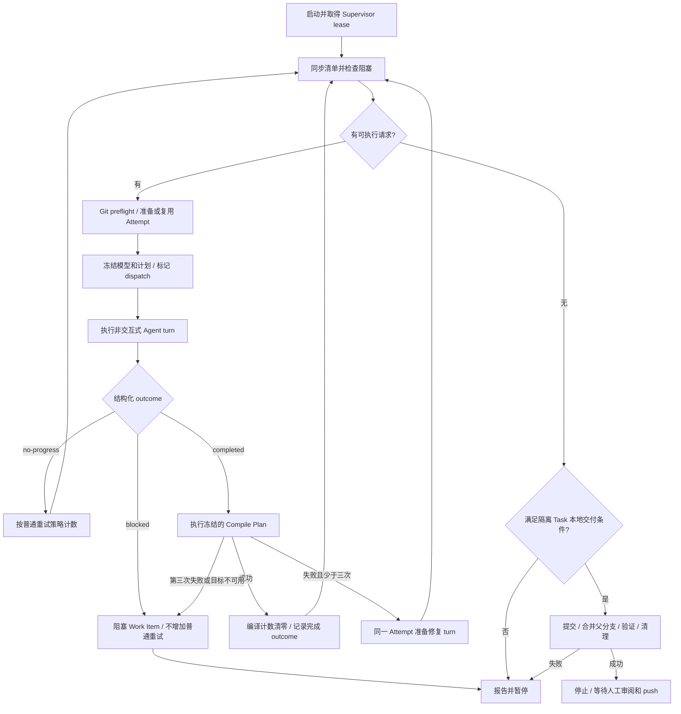

# `workflow supervise` 当前执行流程

本文描述当前源码。`supervise` 是前台、单 Task、顺序执行的循环：派发受管 Agent
turn，解析结构化结果，执行编译和有界修复，最后在满足条件时完成本地 Git
交付。它不自动 push、发布 PR 或 archive。

完整多角色架构的目标和已接通范围见[多角色交接](multi-actor-turn-handoff.md)。

## Quick start：从新 Task 开始

以下示例在仓库根目录使用 PowerShell。将 `payment-retry` 和模型名称换成实际值。
前提是已安装 AIW、Git、所选 Agent CLI，并已完成该 CLI 的认证；项目应有可用的
compile-only 脚本或受支持的编译适配器。

### 1. 创建并明确任务

```powershell
aiw init
aiw new payment-retry
aiw show payment-retry
aiw context payment-retry
```

补齐 `openspec/changes/payment-retry/` 中的需求、设计和 `tasks.md`。每项清单应有
明确范围和完成条件；不要让 Agent 从空白任务猜需求。若 Task 已由
`requirement promote` 创建，直接检查现有工件，不要重复创建。

### 2. 准备工作树和计划

先审阅并提交需要带入工作树的任务工件和代码，让当前父分支处于干净状态，再运行：

```powershell
aiw wt add payment-retry
aiw workflow plan payment-retry
aiw workflow recommend-routing payment-retry
aiw wt status payment-retry
```

显式创建工作树便于在启动前确认隔离路径和父分支；supervise 也能按默认规则准备
隔离工作树。检查 `.ai/payment-retry/routing-plan.json` 中的 Profile 和编译目标。
已有 promotion 生成的计划时，只有需要重新推荐才重跑 `recommend-routing`。

首次执行前不要为了“预热”单独运行 `advance`：它可能提前创建一个尚未冻结
supervise Compile Plan 的请求。让 supervise 在生成计划后准备自己的请求。

### 3. 启动前台循环

```powershell
aiw workflow supervise payment-retry start --provider codex --model your-model
```

如果已在 `[ai]` 或 Profile 中配置模型，可省略两个覆盖参数。该终端会持续显示
执行进度。**满足交付条件后，此命令会提交并合并到记录的父分支，然后清理已合并
工作树和分支**；如果只想执行一步且暂不交付，使用下方的单步用法。

### 4. 在另一终端查看进度

```powershell
aiw workflow supervise payment-retry status
aiw workflow report payment-retry
aiw show payment-retry
```

`status` 查看当前请求、lease 和 Gate；`report` 查看最近失败原因；`show` 查看
Task 汇总。没有失败报告不代表任务已经完成。出现暂停时，先按后文故障场景处理。

### 5. 检查结束结果

```powershell
aiw show payment-retry
git status
git log -3 --oneline
```

确认是否已本地合并、是否仍有 Gate、验证是通过还是 waived。自动交付后工作树
可能已被移除，这是正常结果。审阅父分支后，再自行决定 push 和 archive。

## 常规用法 Usage

```powershell
aiw workflow recommend-routing payment-retry
aiw workflow supervise payment-retry start --provider codex --model your-model
aiw workflow supervise payment-retry status
aiw workflow report payment-retry
aiw workflow supervise payment-retry stop
```

`aiw workflow` 与 `aiw task workflow` 使用同一入口。`--provider`、`--model`
只用于 `supervise ... start`。执行默认使用隔离工作树；`run --execute --primary`
是单步执行的显式选项，不是 supervise 参数。启动 supervise 会进入包括本地交付
在内的自动流程。

`requirement promote` 在生成任务工件后调用 `recommend-routing`。手动创建的
Task 也应先生成路由与 Compile Plan。推荐器可调用全局 AI provider；推荐失败时
使用确定性默认路由。计划可审阅，但不要求额外确认才能执行。

| 目的 | 命令 | 注意事项 |
|---|---|---|
| 只预览下一步 | `aiw workflow run payment-retry` | 不启动 Agent，但可能准备并持久化请求；不是完全只读 |
| 执行一个 Work Item | `aiw workflow run payment-retry --execute` | 不自动交付；不等同于 supervise 的编译修复循环 |
| 显式在主工作区执行一步 | `aiw workflow run payment-retry --execute --primary` | Task 必须绑定主工作区 |
| 请求停止循环 | `aiw workflow supervise payment-retry stop` | 保留状态；确认在途进程结束后再启动新循环 |
| 处理问题后继续 | `aiw workflow supervise payment-retry start` | 保留已有请求快照；不会自动清除 Gate |
| 调整普通重试上限 | `aiw workflow retry-policy payment-retry wi-0001 3` | 范围 1–5；不改变三次编译失败上限 |

如果目标是只读观察，使用 `show`、`status`、`diagnose`、`report`。
如果随后要切换到 supervise，不要把单步预览或执行产生的旧请求当作已经配置好
Compile Plan；先检查 `status` 是否仍有 prepared request。

## 模型与编译计划

模型定义来自 `aiw.toml` / `.aiw.toml`：

```toml
[ai.profiles.fast]
provider = "copilot"
model = "your-fast-model"

[ai.profiles.balanced]
provider = "codex"
model = "your-coding-model"

[ai.profiles.reasoning]
provider = "codex"
model = "your-reasoning-model"
```

Profile 必须同时包含非空 `provider` 和 `model`；缺失或不完整时回退到全局
`[ai]`。配置加载和环境覆盖由 `internal/ai/config.go` 负责。

默认映射为 `analysis=fast`、`coder/tester=balanced`、`verifier=reasoning`。
**当前 supervise 实际读取路由计划中的 `coder` 项**，尚未按角色自动调度全部
Actor。没有按难度或失败次数自动升级模型的机制。

新请求将 Profile、provider、model 和无密钥摘要存入 `AISelection`；启动时的
CLI 覆盖在生成快照时应用。执行与编译修复复用该选择，修改配置或重启时传入其他
模型不会覆盖已有请求。普通 `turn`、`chat` 和 CZ 保留各自已有的解析方式。

`.ai/<task-id>/routing-plan.json` 同时保存 Compile Plan。supervise 准备请求时
冻结计划，恢复和修复不重新读取可变计划。缺少计划会打开 `compile-plan-missing`
Gate；需按诊断处理 Gate，生成计划并准备新请求，不能只修改文件就继续旧请求。

编译器不调用 LLM。它按变更路径选择计划目标；共享或无法映射的变更采用全目标
回退。目标必须是仓库内脚本或已支持的内置适配器；不可用目标会打开 Gate。

## 执行循环



### 结果与完成条件

派发前保存 `DispatchedAt` 和预期 Session turn。读取结果时检查 Session 完成
状态、最终输出文件、Attempt 绑定及 turn，避免消费旧输出。Agent 必须返回
`completed`、`blocked` 或 `no-progress` 的结构化 JSON；普通文本或无效结构按
no-progress 处理。结果不完整或绑定不符时暂停，保留诊断。

勾选 `tasks.md` 不会绕过活跃的受管编译、阻塞状态或未清除的编译失败。
编译通过并关闭 Attempt 后，由清单同步决定 Work Item 完成及后续调度。

### 两类失败计数

| 情况 | 处理 |
|---|---|
| 初始 Git preflight 失败 | 创建或更新唯一 workspace-access Gate；不创建新 Attempt、不消耗重试 |
| Agent blocked | 打开 Gate 并阻塞 Work Item；普通重试计数不增加 |
| Agent no-progress | 增加 NoProgressCount；未耗尽可再试，达到策略上限后阻塞 |
| 编译失败 | 增加独立编译计数；同一 Attempt 内准备修复 turn |
| 第三次连续编译失败 | 停止自动修复；初次失败后最多再有两次修复 turn |
| 编译成功 | 连续编译失败计数清零，再记录 Agent 完成 outcome |

编译结果和计数持久化，恢复复用已完成结果。修复保留 Attempt、工作树、模型与
计划，清除派发标记并绑定下一次 Session turn，再回到正常派发路径。
Agent 不自行编译或运行测试；supervisor 执行冻结的 Compile Plan。

普通重试默认上限为 3，可通过 `retry-policy` 在 1–5 之间设置。处理相关 Gate
后，使用 `reopen` 显式恢复 blocked Work Item；非耗尽的普通计数不会因此清零。

### 可选测试与 lease

没有 Verification Plan 时，可选 focused-verification Work Item 会记录 waived，
不启动测试。已有计划走单独的 focused-test 授权和受控执行路径。编译成功不能
解释成测试成功，也不意味着完整 Analysis → Tester → Verifier 流程已接通。

Supervisor 持有唯一 lease，在 Agent 执行期间输出心跳和续租，编译之后也会
续租。`stop` 保留任务、请求和证据；不能将它视为立即杀死正在运行的子进程。

## 本地交付与冲突

没有可执行 Work Item、执行完成、验证为 passed/waived/not-required，且无阻塞
Gate、待处理请求、写入 lease 或投影修复时，隔离 Task 可进入 `localMergeDelivery`。
它检查父分支和工作树，提交 Task 变更，合并到记录的 `parent_branch`，验证祖先
关系，随后移除已合并的 Task 工作树及分支。主工作区 Task 不走这条隔离交付路径。

合并冲突时，当前实现尝试撤销父工作区这次合并，再将父分支合入原 Task 工作树，
将该工作树保留为冲突候选。它报告使用 `resolving-merge-conflicts` 并请求审阅，
**不会自动调用该 Skill，也不会创建额外临时冲突工作树**。
这与 `aiw wt pull --conflict-handoff` 的显式提案流程不同。

## 持久化与恢复

| 路径 | 用途 |
|---|---|
| `.ai/<task-id>/state.json`、`events.jsonl` | Work Item、Attempt、Gate、请求快照、lease、审计事件 |
| `.ai/<task-id>/routing-plan.json` | 角色路由和 Compile Plan |
| `.ai/<task-id>/artifacts/handoff.md` | 当前工作交接 |
| `.ai/<task-id>/artifacts/compiler-repair.md` | 编译修复指引 |
| `.ai/<task-id>/compile-diagnostics/` | 编译命令、退出码和诊断 |
| `.ai/<task-id>/reports/attempts/` | 不可变失败记录 |
| `.ai/<task-id>/reports/latest-failure.md` | 原因、可重试性、责任方、下一步和证据引用 |
| `.ai/sessions/<session-id>/` | Session 状态、提示词、输出和线程信息 |
| `openspec/changes/<task-id>/tasks.md` | 人工清单与 Workflow 投影 |

```powershell
aiw workflow report payment-retry
aiw workflow diagnose payment-retry
aiw workflow recover payment-retry
aiw workflow repair payment-retry
```

`report` 只读取报告，不初始化状态，也无需逐个查看 Session outputs。
`recover` 恢复持久化状态事件，`repair` 修复投影；它们不重新执行 Agent。
处理 Gate 后应根据诊断决定是否 reopen 和重新 start。

## 出现问题时如何处理

### 先判断属于哪一层

```powershell
aiw workflow supervise payment-retry status
aiw workflow report payment-retry
aiw workflow diagnose payment-retry
```

记下实际 Work Item ID、Attempt ID、Gate ID、错误原因和 `next action`。
下方 `wi-0001` 等值只是示例，以输出为准。`resolved` 表示原因已解决；`waived`
表示明确接受例外，不能把 waived 当作通用的“继续”按钮。

### 场景 1：Git 报 dubious ownership 或 workspace-access

**现象：** preflight 失败，报告出现 `workspace-access`，Agent 尚未开始新 Attempt。

1. 用 `aiw wt status payment-retry`、`aiw wt list` 检查 Task 的工作树路径和注册信息。
2. 若目录仍存在而注册信息损坏，按诊断使用 `aiw wt repair`；若目录丢失，先恢复或
   修复 Task 绑定，不要直接删除 Task 重建。
3. 在正确用户和路径下确认 Git 可访问后，再解决 Gate 并启动：

```powershell
aiw workflow gate payment-retry workspace-access resolved
aiw workflow supervise payment-retry start
```

这个 preflight Gate 通常没有把 Work Item 本身置为 blocked，因此不应盲目调用
`reopen`。若错误再次出现，新的 preflight 会重新阻塞；不要用全局
`safe.directory=*` 绕过路径检查。

### 场景 2：Agent 报 blocked，例如等待依赖或业务决策

**例子：** `wi-0001` 等待接口定义，报告 Gate 为 `supervised-dependency-wi-0001`。
先补齐明确的接口定义或完成前置工作，并更新任务工件，再执行：

```powershell
aiw workflow gate payment-retry supervised-dependency-wi-0001 resolved
aiw workflow reopen payment-retry wi-0001 "接口定义已确认并更新任务工件"
aiw workflow supervise payment-retry start
```

必须先处理该 Work Item 和 Task 级的所有相关 Gate。只重复 start 不会消除阻塞；
`reopen` 也不会替你解决业务问题或增加权限。

### 场景 3：no-progress 重试耗尽

**现象：** `diagnose` 显示 `retry-limit-exhausted`。常见原因包括重复无效输出、
任务范围过大，或 Agent 没按要求返回结构化 JSON。

先检查报告引用的最近输出，缩小清单范围或修正交接指引；有实际改变后再恢复：

```powershell
aiw workflow reopen payment-retry wi-0001 "已拆清实现步骤并修正输出要求"
aiw workflow supervise payment-retry start
```

示例以没有其他未解决 Gate 为前提。不要只提高 retry-policy 后重复相同失败。
若需要换模型，先确认旧 Attempt 已结束、没有 prepared request，再给新请求传入
`start --provider ... --model ...`；旧请求的模型快照不会被覆盖。

### 场景 4：连续三次编译失败

**现象：** 报告包含编译诊断，出现 `compiler-repair-limit-*`，Work Item 停止修复。

1. 阅读 `.ai/payment-retry/compile-diagnostics/` 中报告引用的文件，判断是代码错误
   还是本地编译环境问题。
2. 修正报错代码、编译脚本或准备缺失的本地依赖。不要手动清零计数来隐藏失败。
3. 按 `diagnose` 列出的实际 ID 解决全部相关编译/validation Gate，再 reopen。

```powershell
# 将此值替换为 diagnose 输出中的实际 Gate ID；多个 Gate 逐个处理。
$gateId = 'compiler-repair-limit-wi-0001'
aiw workflow gate payment-retry $gateId resolved
aiw workflow diagnose payment-retry
# 确认相关 Gate 均已解决，且 Work Item 为 blocked 后：
aiw workflow reopen payment-retry wi-0001 "已修正编译错误，等待重新编译确认"
aiw workflow supervise payment-retry start
```

Gate 也可能按 Attempt 命名，且另有 `supervised-validation-*`；不能只复制示例
解决一个 Gate。reopen 不代表编译通过，只有实际成功的编译结果才会清零。

### 场景 5：compile-plan-missing 或 compile-target-unavailable

**原因：** 请求没有冻结计划，或计划所指向的脚本/适配器不可用。先准备仓库内的
compile-only 脚本，确认它在 Task 工作树中可用，再重新生成和审阅计划：

```powershell
aiw workflow recommend-routing payment-retry
aiw workflow diagnose payment-retry
aiw workflow supervise payment-retry status
```

新计划不会更新已经冻结的请求。若旧请求仍持有 Attempt/写入 lease，当前命令
没有一个通用的“丢弃请求并换计划”快捷操作；先保留现场并处理该 Attempt，不能
假设 `recover`、`repair` 或 `reopen` 会清除它。需要新请求时，应通过受管流程
完成旧请求的处理，再重新启动；不要编辑 `state.json` 或删除 lease 文件。

### 场景 6：终端退出、Session 结果不完整或 stale

先确认旧 Agent/编译进程是否仍在运行。`write-lease-active` 表示已有 Attempt
拥有工作区，不应立即再开第二个 Attempt。

如果诊断明确指出有待恢复事件或投影失败，分别使用：

```powershell
aiw workflow recover payment-retry
aiw workflow repair payment-retry
aiw workflow supervise payment-retry status
```

仅执行诊断要求的恢复操作。Session 完成状态、Attempt 或 turn 不匹配时，应查看
报告指向的 Session 输出并处理绑定问题；不要把旧输出改名来冒充新结果。确认
原进程退出且请求可恢复后再 start；这不会自动重放未知的外部操作。

### 场景 7：本地交付失败或合并冲突

**父分支变脏/切换：** 先在父工作区审阅自己的改动并恢复预期分支，不要用
`reset --hard` 清理他人的工作。满足前置条件后，处理实际 delivery Gate 再继续。

**合并冲突：** 用 `aiw wt status payment-retry` 确认保留的候选工作树。在该
工作树中使用 `resolving-merge-conflicts` 检查双方意图，完成经审阅的冲突解决和
必要验证。Skill 不会被 supervise 自动调用；需要业务取舍时由人决定。

所有相关 Gate 已处理、Task 已满足交付条件后，可显式重试本地交付：

```powershell
aiw workflow local-merge payment-retry "Complete payment retry"
```

这条命令会提交、合并和清理，不是预览。若合并已经成功但清理失败，先核实祖先
关系与 delivery 状态，按诊断修复剩余清理；不要重复合并或直接删除目录。

### 场景 8：无可运行项目，但 Task 尚未交付

`no-executable-work` 不等于成功：可能仍有未满足依赖、未完成的验证或 Gate，也
可能 Task 绑定主工作区而不适用自动隔离交付。检查 `show`、`diagnose` 和清单，
处理具体原因。可选测试确实决定不运行时，可以明确记录跳过：

```powershell
aiw workflow skip-focused-test payment-retry "本次不运行可选聚焦测试，已记录验证范围"
```

该命令只用于可选 focused verification，不是绕过必需验证或业务 Gate 的方法。

## 实现位置与验证范围

- `internal/commands/task/workflow_supervisor.go`：循环、结构化结果、本地交付入口。
- `internal/commands/task/workflow_commands.go`：路由、请求准备、派发。
- `internal/commands/task/workflow_compile.go`：冻结计划、编译与修复交接。
- `internal/commands/task/local_delivery.go`：本地交付和冲突保留。
- `internal/workflow/attempts.go`、`compile.go`、`failure_report.go`：重试、编译结果和报告。

上述 Gate 去重、结果分类、编译计数和报告读取有自动化回归用例。替身测试验证
受管状态和调用逻辑，不代表真实 Windows ownership 拒绝、外部模型或实际 Git
交付已经端到端验收。本文更新只进行了静态源码核对。
