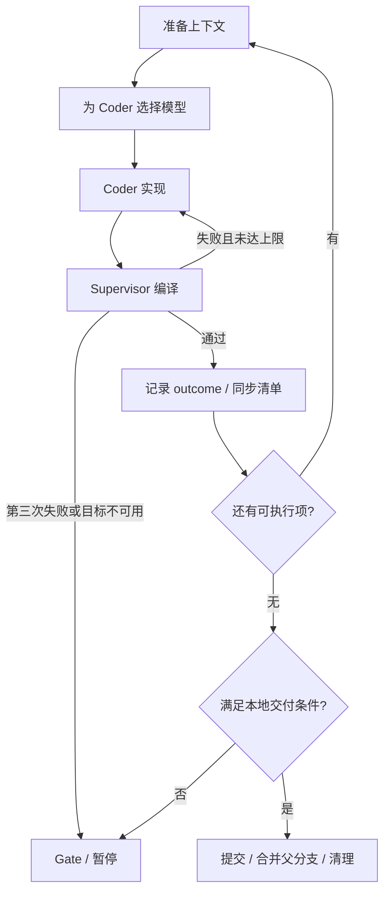
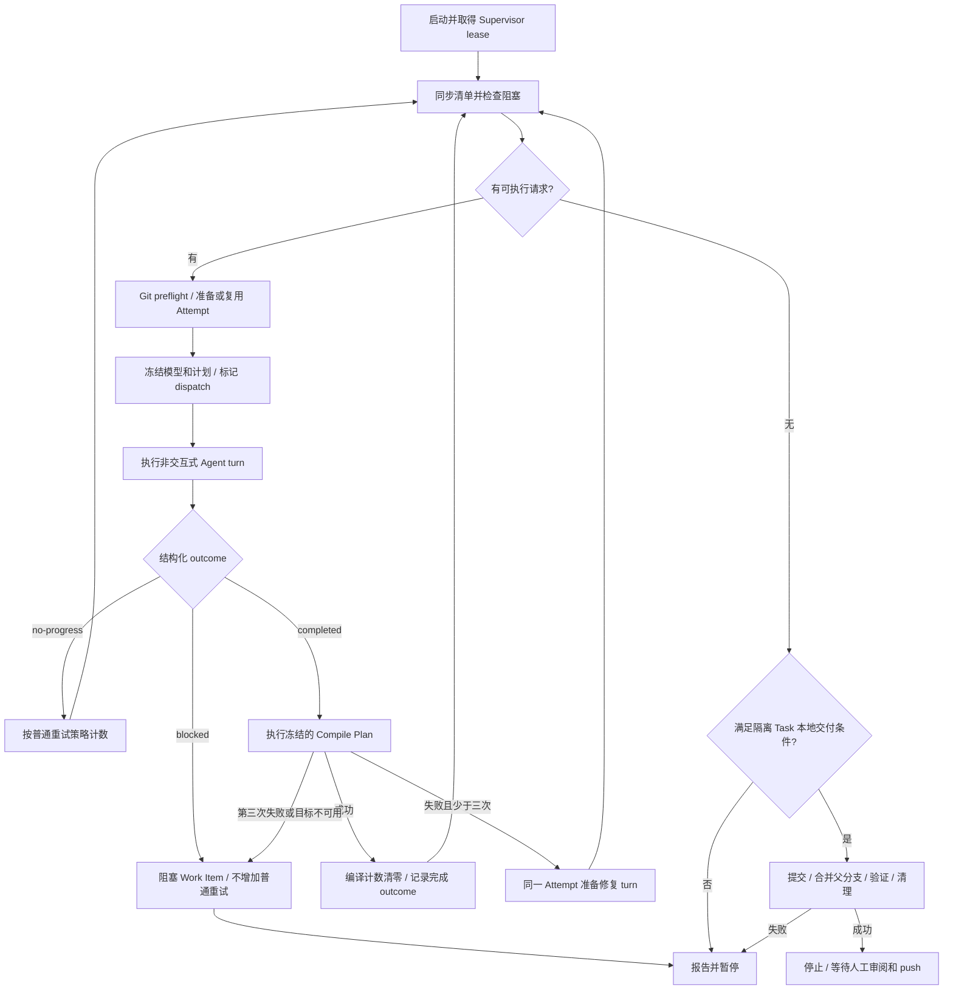

# `workflow supervise` 当前执行流程

## 默认执行路径与协议版本

当前新 Task 默认使用 **schema 9**。下图和本文常规命令描述这条已接通的 CLI
路径。源码另有 schema 10 持久化多阶段协议，但只有受控宿主、授权服务、预算服务
及平台证据齐备后才能通过受管迁移启用；`supervise start` 不负责启用它。

Task 建立时可以没有 Session；首次准备受管 Agent 请求时，Workflow 先将同名
Session 绑定写入 Task 元数据，再创建或读取 Session，成功后才创建 Attempt。
其他 Session ID 缺失、损坏或已归档时保持原有诊断，不自动重建。


```mermaid
flowchart TD
    A[准备上下文] --> B[为 Coder 选择模型]
    B --> C[Coder 实现]
    C --> D[Supervisor 编译]
    D -- 失败且未达上限 --> C
    D -- 第三次失败或目标不可用 --> P[Gate / 暂停]
    D -- 通过 --> E[记录 outcome / 同步清单]
    E --> F{还有可执行项?}
    F -- 有 --> A
    F -- 无 --> G{满足本地交付条件?}
    G -- 是 --> H[提交 / 合并父分支 / 清理]
    G -- 否 --> P
```

本文描述当前源码。`supervise` 是前台、单 Task、顺序执行的循环：派发受管 Agent
turn，解析结构化结果，执行编译和有界修复，最后在满足条件时完成本地 Git
交付。它不自动 push、发布 PR 或 archive。

Tester、受控测试 Runner、Verifier 和知识生成不属于默认循环中的必经自动步骤。
schema 10 的实现与启用边界见下方专节；总体流程见[自动编码](auto-coding.md)。

## Quick start：从新 Task 开始

以下示例在仓库根目录使用 PowerShell。将 `payment-retry` 和模型名称换成实际值。
前提是已安装 AIW、Git、所选 Agent CLI，并已完成该 CLI 的认证；项目应有可用的
compile-only 脚本或受支持的编译适配器。

### 1. 创建并明确任务

```powershell
aiw init
aiw new payment-retry
aiw show payment-retry
aiw context payment-retry
```

补齐 `openspec/changes/payment-retry/` 中的需求、设计和 `tasks.md`。每项清单应有
明确范围和完成条件；不要让 Agent 从空白任务猜需求。若 Task 已由
`requirement promote` 创建，直接检查现有工件，不要重复创建。

### 2. 准备工作树和计划

先审阅并提交需要带入工作树的任务工件和代码，让当前父分支处于干净状态，再运行：

```powershell
aiw wt add payment-retry
aiw wf plan payment-retry
aiw wf recommend-routing payment-retry
aiw wt status payment-retry
```

显式创建工作树便于在启动前确认隔离路径和父分支；supervise 也能按默认规则准备
隔离工作树。检查 `.ai/payment-retry/routing-plan.json` 中的 Profile 和编译目标。
已有 promotion 生成的计划时，只有需要重新推荐才重跑 `recommend-routing`。

首次执行前不要为了“预热”单独运行 `advance`：它可能提前创建一个尚未冻结
supervise Compile Plan 的请求。让 supervise 在生成计划后准备自己的请求。

### 3. 启动前台循环

```powershell
aiw wf supervise payment-retry start --provider codex --model your-model
```

如果已在 `[ai]` 或 Profile 中配置模型，可省略两个覆盖参数。该终端会持续显示
执行进度。**满足交付条件后，此命令会提交并合并到记录的父分支，然后清理已合并
工作树和分支**；如果只想执行一步且暂不交付，使用下方的单步用法。

### 4. 在另一终端查看进度

```powershell
aiw wf supervise payment-retry status
aiw wf report payment-retry
aiw show payment-retry
```

`status` 查看当前请求、lease 和 Gate；`report` 查看最近失败原因；`show` 查看
Task 汇总。没有失败报告不代表任务已经完成。出现暂停时，先按后文故障场景处理。

### 5. 检查结束结果

```powershell
aiw show payment-retry
git status
git log -3 --oneline
```

确认是否已本地合并、是否仍有 Gate、验证是通过还是 waived。自动交付后工作树
可能已被移除，这是正常结果。审阅父分支后，再自行决定 push 和 archive。

## 常规用法 Usage

```powershell
aiw wf recommend-routing payment-retry
aiw wf supervise payment-retry start --provider codex --model your-model
aiw wf supervise payment-retry status
aiw wf report payment-retry
aiw wf supervise payment-retry stop
```

`aiw wf` 与 `aiw wf` 使用同一入口。`--provider`、`--model`
只用于 `supervise ... start`。执行默认使用隔离工作树；`run --execute --primary`
是单步执行的显式选项，不是 supervise 参数。启动 supervise 会进入包括本地交付
在内的自动流程。

`requirement promote` 在生成任务工件后调用 `recommend-routing`。手动创建的
Task 也应先生成路由与 Compile Plan。推荐器可调用全局 AI provider；推荐失败时
使用确定性默认路由。计划可审阅，但不要求额外确认才能执行。

| 目的 | 命令 | 注意事项 |
|---|---|---|
| 只预览下一步 | `aiw wf run payment-retry` | 不启动 Agent，但可能准备并持久化请求；不是完全只读 |
| 执行一个 Work Item | `aiw wf run payment-retry --execute` | 不自动交付；不等同于 supervise 的编译修复循环 |
| 显式在主工作区执行一步 | `aiw wf run payment-retry --execute --primary` | Task 必须绑定主工作区 |
| 请求停止循环 | `aiw wf supervise payment-retry stop` | 保留状态；确认在途进程结束后再启动新循环 |
| 处理问题后继续 | `aiw wf supervise payment-retry start` | 保留已有请求快照；不会自动清除 Gate |
| 调整普通重试上限 | `aiw wf retry-policy payment-retry wi-0001 3` | 范围 1–5；不改变三次编译失败上限 |

如果目标是只读观察，使用 `show`、`status`、`diagnose`、`report`。
如果随后要切换到 supervise，不要把单步预览或执行产生的旧请求当作已经配置好
Compile Plan；先检查 `status` 是否仍有 prepared request。

## 模型与编译计划

模型定义来自 `aiw.toml` / `.aiw.toml`：

```toml
[ai.profiles.fast]
provider = "copilot"
model = "your-fast-model"

[ai.profiles.balanced]
provider = "codex"
model = "your-coding-model"

[ai.profiles.reasoning]
provider = "codex"
model = "your-reasoning-model"
```

Profile 必须同时包含非空 `provider` 和 `model`；缺失或不完整时回退到全局
`[ai]`。配置加载和环境覆盖由 `internal/ai/config.go` 负责。

默认映射为 `analysis=fast`、`coder/tester=balanced`、`verifier=reasoning`。
**默认 schema 9 supervise 实际读取路由计划中的 `coder` 项**，尚未按角色自动
调度全部 Actor，也不按失败次数升级模型。schema 10 另有按 Actor 记账的模型
路由和升级服务，不能把它的能力当作默认 CLI 行为。

新请求将 Profile、provider、model 和无密钥摘要存入 `AISelection`；启动时的
CLI 覆盖在生成快照时应用。执行与编译修复复用该选择，修改配置或重启时传入其他
模型不会覆盖已有请求。普通 `turn`、`chat` 和 CZ 保留各自已有的解析方式。

`.ai/tasks/<task-id>/routing-plan.json` 同时保存 Compile Plan。supervise 准备请求时
冻结计划，恢复和修复不重新读取可变计划。缺少计划会打开 `compile-plan-missing`
Gate；需按诊断处理 Gate，生成计划并准备新请求，不能只修改文件就继续旧请求。

编译器不调用 LLM。它按变更路径选择计划目标；共享或无法映射的变更采用全目标
回退。目标必须是仓库内脚本或已支持的内置适配器；不可用目标会打开 Gate。

## 执行循环


```mermaid
flowchart TD
    A[启动并取得 Supervisor lease] --> B[同步清单并检查阻塞]
    B --> C{有可执行请求?}
    C -- 有 --> D[Git preflight / 准备或复用 Attempt]
    D --> E[冻结模型和计划 / 标记 dispatch]
    E --> F[执行非交互式 Agent turn]
    F --> G{结构化 outcome}
    G -- blocked --> H[阻塞 Work Item / 不增加普通重试]
    G -- no-progress --> I[按普通重试策略计数]
    G -- completed --> J[执行冻结的 Compile Plan]
    J -- 成功 --> K[编译计数清零 / 记录完成 outcome]
    J -- 失败且少于三次 --> L[同一 Attempt 准备修复 turn]
    L --> B
    J -- 第三次失败或目标不可用 --> H
    K --> B
    I --> B
    H --> P[报告并暂停]
    C -- 无 --> M{满足隔离 Task 本地交付条件?}
    M -- 是 --> N[提交 / 合并父分支 / 验证 / 清理]
    M -- 否 --> P
    N -- 成功 --> O[停止 / 等待人工审阅和 push]
    N -- 失败 --> P
```

### 结果与完成条件

已派发请求即使 Runner 报错，也先核对原 Session/turn；只有绑定的 Session
结果报告 no-progress 才计入该预算。结果仍未知时保留 Attempt 和写入租约。
人工 Gate 答复会在一个可恢复的状态事件中完成 Gate 转换、适用时重开 WorkItem
和答复消费；若其他 Gate 仍开放，WorkItem 保持 blocked。

`aiw wf supervise <task-id> status` 会区分重试资格时间与实际调度：到期不代表
后台已经自动重启。状态输出会给出待填写的答复文件或手动 `start` 下一步。

`tasks.md` 暂时读取失败时，Supervisor 最多重试两次读取；仍失败则保存
`checklist-paused` 原因并暂停，不将其算作 Agent no-progress，也不新建 Attempt。
清单解析冲突和权限错误不会自动重试或跳过。修复原文件后再执行
`aiw wf supervise <task-id> start`。这不改变 OpenSpec 清单作为当前规划来源的约定。

已派发请求的 Session 结果暂时未知时，Supervisor 有界重读同一 Session；仍未知
则写入绑定原 Attempt、Session 和 turn 的人工答复文件。选择 `resume-supervisor`
后只重新观察原请求；绑定或写入租约已变化时答复保留待人工检查，不派发第二次
模型调用。

派发前保存 `DispatchedAt` 和预期 Session turn。读取结果时检查 Session 完成
状态、最终输出文件、Attempt 绑定及 turn，避免消费旧输出。Agent 必须返回
`completed`、`blocked` 或 `no-progress` 的结构化 JSON；普通文本或无效结构按
no-progress 处理。结果不完整或绑定不符时暂停，保留诊断。

原始输出先按精确请求归档为 execution report。若请求带有冻结的
`InputReference`，还要校验 implementation report 的请求身份、输入摘要、变更
引用和各事实章节；报告无效时最多准备一次报告补充，仍无效则打开
`report-manual-review` Gate。报告校验通过本身不代表 Work Item 已被接受。

勾选 `tasks.md` 不会绕过活跃的受管编译、阻塞状态或未清除的编译失败。
编译通过并关闭 Attempt 后，由清单同步决定 Work Item 完成及后续调度。

### 两类失败计数

| 情况 | 处理 |
|---|---|
| 初始 Git preflight 失败 | 创建或更新唯一 workspace-access Gate；不创建新 Attempt、不消耗重试 |
| Agent blocked | 打开 Gate 并阻塞 Work Item；普通重试计数不增加 |
| Agent no-progress | 增加 NoProgressCount；未耗尽可再试，达到策略上限后阻塞 |
| 编译失败 | 增加独立编译计数；同一 Attempt 内准备修复 turn |
| 第三次连续编译失败 | 停止自动修复；初次失败后最多再有两次修复 turn |
| 编译成功 | 连续编译失败计数清零，再记录 Agent 完成 outcome |

编译结果和计数持久化，恢复复用已完成结果。修复保留 Attempt、工作树、模型与
计划，清除派发标记并绑定下一次 Session turn，再回到正常派发路径。
Agent 不自行编译或运行测试；supervisor 执行冻结的 Compile Plan。

普通重试默认上限为 3，可通过 `retry-policy` 在 1–5 之间设置。处理相关 Gate
后，使用 `reopen` 显式恢复 blocked Work Item；非耗尽的普通计数不会因此清零。

### 监督 Agent 的限定 Git 查询

每个通过当前工作区预检后才会派发的监督 Agent 请求，都包含限定到该工作树的只读
Git 查询前缀。它等价于：

```powershell
git -c "safe.directory=<当前预检确认的规范工作树>" -C "<同一规范工作树>" status
```

其中目录必须来自本次请求的预检结果；不要从旧 handoff、先前 Attempt 或环境变量
推断路径。前缀仅用于 `status`、分支和 diff 等原有只读查询，**不**授权
`git config`、提交、分支、索引或其他 Git 写入，也不改变 Agent 的文件编辑范围。
普通实现项和 scope-review 项都会得到该查询说明；后者仍额外保留只能修改所选
checkbox 的编辑限制。

若预检没有给出恰好一个与当前工作树匹配的 `safe.directory`，派发会在调用
provider 前失败并保留 `workspace-access` 诊断。不要用 `safe.directory=*`、
`git config --global` 或额外目录信任来绕过该失败。

### 可选测试与 lease

没有 Verification Plan 时，可选 focused-verification Work Item 会记录 waived，
不启动测试。已有计划走单独的 focused-test 授权和受控执行路径。编译成功不能
解释成测试成功，也不意味着完整 Analysis → Tester → Verifier 流程已接通。

Supervisor 持有唯一 lease，在 Agent 执行期间输出心跳和续租，编译之后也会
续租。`stop` 保留任务、请求和证据；不能将它视为立即杀死正在运行的子进程。

## 默认 schema 9 的本地交付与冲突

没有可执行 Work Item、执行完成、验证为 passed/waived/not-required，且无阻塞
Gate、待处理请求、写入 lease 或投影修复时，隔离 Task 可进入 `localMergeDelivery`。
它检查父分支和工作树，提交 Task 变更，合并到记录的 `parent_branch`，验证祖先
关系，随后移除已合并的 Task 工作树及分支。主工作区 Task 不走这条隔离交付路径。

合并冲突时，当前实现尝试撤销父工作区这次合并，再将父分支合入原 Task 工作树，
将该工作树保留为冲突候选。它报告使用 `resolving-merge-conflicts` 并请求审阅，
**不会自动调用该 Skill，也不会创建额外临时冲突工作树**。
这与 `aiw wt pull --conflict-handoff` 的显式提案流程不同。

## 持久化与恢复

| 路径 | 用途 |
|---|---|
| `.ai/tasks/<task-id>/state.json`、`events.jsonl` | Work Item、Attempt、Gate、请求快照、lease、审计事件 |
| `.ai/tasks/<task-id>/task.toml` | Task 生命周期元数据；旧 OpenSpec 目录内元数据仅作兼容读取 |
| `.ai/tasks/<task-id>/routing-plan.json` | 角色路由和 Compile Plan |
| `.ai/tasks/<task-id>/artifacts/handoff.md` | 当前工作交接 |
| `.ai/tasks/<task-id>/artifacts/compiler-repair.md` | 编译修复指引 |
| `.ai/tasks/<task-id>/compile-diagnostics/` | 编译命令、退出码和诊断 |
| `.ai/tasks/<task-id>/reports/attempts/` | 不可变失败记录 |
| `.ai/tasks/<task-id>/reports/latest-failure.md` | 原因、可重试性、责任方、下一步和证据引用 |
| `.ai/sessions/<session-id>/` | Session 状态、提示词、输出和线程信息 |
| `openspec/changes/<task-id>/tasks.md` | 人工清单与 Workflow 投影 |

```powershell
aiw wf report payment-retry
aiw wf diagnose payment-retry
aiw wf recover payment-retry
aiw wf repair payment-retry
```

`report` 只读取报告，不初始化状态，也无需逐个查看 Session outputs。
`recover` 恢复持久化状态事件，`repair` 修复投影；它们不重新执行 Agent。
`supervise start` 遇到已完成 Work Item 的 `tasks.md` 写回修复记录时，会重试该写回；
确认成功后关闭对应记录并继续处理后续 Work Item。写回失败时保留记录并暂停。
`continue/resume` 选择 `repair-projection` 或 `repair-session` 时只执行修复；修复失败
保留答复供重试，成功后提示下一条 `supervise start` 命令。
Schema 9 `supervise` 遇到非预算 Gate 时，会在
`.ai/tasks/<task-id>/reports/remediation/` 写入带风险说明的报告和 `.response.json`
答复模板；填写 `option_id`、`operator`、`risk_confirmed`，确认或豁免 Gate 时还须
填写 `note`，再运行 `aiw wf continue <task-id>`。`continue` 只处理报告中绑定的
Gate 和 WorkItem；`supervise start` 遇到待答复报告时只显示选项，不派发新 Agent。
预算 Gate 仍须通过 `aiw wf budget` 的授权命令处理。
处理 Gate 后应根据诊断决定是否 reopen 和重新 start。

若 `state.json` 缺失，`start` 仅在存在有效、ID 匹配的持久 Task 元数据时初始化
非活跃投影。change 目录或 migration marker 不能替代元数据，也不能恢复丢失的
Attempt 历史。`status` 不执行这种初始化。

### 编译暂停状态与下一步

`aiw wf supervise <task-id> status` 的 `Compilation` 区分以下情况：

- `repair-prepared`：同一 Attempt 的修复轮次已准备好；确认没有其他 supervisor 正在运行后，用 `aiw wf supervise <task-id> start` 继续。
- `plan-missing`：先用 `aiw wf diagnose <task-id>` 检查冻结计划和当前 Attempt；不要直接替换仍活跃的请求。
- `target-unavailable`：先修复 Task 工作区中的编译目标，再检查 Gate；不能仅因脚本已存在就假定原请求可恢复。
- `repair-limit-reached`：检查编译诊断并人工修复；确认修复后再按 `diagnose` 的实际 Gate 和 Work Item 状态处理。
- `result-unknown`：先核对编译请求与已记录结果；未知结果不能直接当作失败或成功重跑。

`Retry` 的时间只表示重试资格，不表示存在自动后台调度。以上提示只读，不解决 Gate、不重开 Work Item，也不覆盖已有请求。

%% Verification (2026-09-28): 已静态检查 status 分类与输出路径；`python scripts/compile.py` 退出码为 0。新增的状态分类测试和端到端恢复验证均未运行。

## schema 10：已实现的受控协议与启用边界

`internal/workflow/execution_protocol.go` 定义阶段
`coder → report-validation → compile → tester → test-run → acceptance → accepted`。
Coder 完成只结束实现阶段；Tester 使用独立 Session 和测试路径写入范围，测试
Runner 只执行冻结 manifest。结果需绑定请求、输入、Session turn 和 lease generation。

这条路径需要受控宿主接入 `ExecutionServices`，并提供授权、预算、结果及接受
校验和平台启用证据。`JournaledVerificationHost` 还要求完整的执行边界；缺少
宿主、网络隔离或独立断言审查能力时拒绝执行，不降级成普通 shell。

**当前通用 CLI 的 `NextRunnerOutcome` 对 schema 10 返回 blocked，要求受控阶段
适配器，并禁用旧派发。** 因此不能靠再次 `supervise start` 运行完整多角色链路，
也不能手改 `schema_version` 启用。命令面没有通用的迁移、grant 或解除 Stop 操作。

| 事项 | schema 10 行为 |
|---|---|
| 明确 Stop | 即使没有前台 Supervisor 也持久保存；重启不解除，不代表在途进程已退出 |
| 结果未知 | 通过原执行器只读对账，保留请求、预留额度和写入权；缺输出不能证明未派发 |
| 已保存结果 | 校验后消费原结果，不重新调用模型或测试命令 |
| 预算 | 按 Actor/生成请求记账；升级使用配置中的不同模型顺序，重启不刷新额度 |
| 旧预算不明 | 保留未知状态并要求人工决策，不归零，也不伪记耗尽 |
| 本地交付 | 要求冻结计划、精确授权及受控交付宿主；旧 `local-merge` 被拒绝 |
| 清理 | 独立授权，并要求已记录合并和 sealed-source 证据；不自动撤销冲突或强删资源 |

基础设施恢复、实现/测试修复、报告补充各有自己的边界，不能用默认 schema 9 的
`retry-policy` 或 `reopen` 说明替代。下方故障操作示例面向默认 schema 9；遇到
durable/controlled-adapter 提示时，应处理受控宿主接入或原请求对账。

辅助宿主可处理 Verifier、Task memory 和项目知识的持久队列，保存等待或未知状态；
它不是持续轮询守护进程，也不是默认循环必然启动的步骤。配置、能力证据和明确
Task 授权不足会记录 host gap。可用维护入口包括：

```powershell
aiw wf auxiliary inventory
aiw wf knowledge show payment-retry
```

`auxiliary policy`、`initialize`、`settle` 和 `knowledge review/import` 属于显式
维护操作，不启用 schema 10，不授予模型或测试执行权限。

## 出现问题时如何处理

### 先判断属于哪一层

```powershell
aiw wf supervise payment-retry status
aiw wf report payment-retry
aiw wf diagnose payment-retry
```

记下实际 Work Item ID、Attempt ID、Gate ID、错误原因和 `next action`。
下方 `wi-0001` 等值只是示例，以输出为准。`resolved` 表示原因已解决；`waived`
表示明确接受例外，不能把 waived 当作通用的“继续”按钮。

### 场景 1：Git 报 dubious ownership 或 workspace-access

**现象：** preflight 失败，报告出现 `workspace-access`，Agent 尚未开始新 Attempt。

1. 用 `aiw wt status payment-retry`、`aiw wt list` 检查 Task 的工作树路径和注册信息。
2. 若目录仍存在而注册信息损坏，按诊断使用 `aiw wt repair`；若目录丢失，先恢复或
   修复 Task 绑定，不要直接删除 Task 重建。
3. 确认执行环境已使用包含限定 Git 查询指令的修复版本，并只对当前预检确认的
   规范工作树验证该只读查询；保留原始失败报告。不要使用旧 handoff 的目录，也不要
   修改持久 Git 配置。
4. 验证成功后，先解决对应 Gate；若历史 Agent outcome 已将 Work Item 标为
   `blocked`，再显式 reopen 该项，最后才启动监督：

```powershell
aiw wf gate payment-retry workspace-access resolved
aiw wf reopen payment-retry wi-0001 "已在当前预检工作树验证限定 Git 查询"
aiw wf supervise payment-retry start
```

初始 preflight Gate 通常没有把 Work Item 本身置为 `blocked`；此时跳过 `reopen`，
不要为了套用示例而执行它。代码更新、清单同步、Gate 解析都不会自动恢复历史项、
清除原始失败证据或启动新 Session。若错误再次出现，保留新诊断并停止；不要扩大
目录信任或循环重试。

### 场景 2：Agent 报 blocked，例如等待依赖或业务决策

**例子：** `wi-0001` 等待接口定义，报告 Gate 为 `supervised-dependency-wi-0001`。
先补齐明确的接口定义或完成前置工作，并更新任务工件，再执行：

```powershell
aiw wf gate payment-retry supervised-dependency-wi-0001 resolved
aiw wf reopen payment-retry wi-0001 "接口定义已确认并更新任务工件"
aiw wf supervise payment-retry start
```

必须先处理该 Work Item 和 Task 级的所有相关 Gate。只重复 start 不会消除阻塞；
`reopen` 也不会替你解决业务问题或增加权限。

### 场景 3：no-progress 重试耗尽

**现象：** `diagnose` 显示 `retry-limit-exhausted`。常见原因包括重复无效输出、
任务范围过大，或 Agent 没按要求返回结构化 JSON。

先检查报告引用的最近输出，缩小清单范围或修正交接指引；有实际改变后再恢复：

```powershell
aiw wf reopen payment-retry wi-0001 "已拆清实现步骤并修正输出要求"
aiw wf supervise payment-retry start
```

示例以没有其他未解决 Gate 为前提。不要只提高 retry-policy 后重复相同失败。
若需要换模型，先确认旧 Attempt 已结束、没有 prepared request，再给新请求传入
`start --provider ... --model ...`；旧请求的模型快照不会被覆盖。

### 场景 4：连续三次编译失败

**现象：** 报告包含编译诊断，出现 `compiler-repair-limit-*`，Work Item 停止修复。

1. 阅读 `.ai/payment-retry/compile-diagnostics/` 中报告引用的文件，判断是代码错误
   还是本地编译环境问题。
2. 修正报错代码、编译脚本或准备缺失的本地依赖。不要手动清零计数来隐藏失败。
3. 按 `diagnose` 列出的实际 ID 解决全部相关编译/validation Gate，再 reopen。

```powershell
# 将此值替换为 diagnose 输出中的实际 Gate ID；多个 Gate 逐个处理。
$gateId = 'compiler-repair-limit-wi-0001'
aiw wf gate payment-retry $gateId resolved
aiw wf diagnose payment-retry
# 确认相关 Gate 均已解决，且 Work Item 为 blocked 后：
aiw wf reopen payment-retry wi-0001 "已修正编译错误，等待重新编译确认"
aiw wf supervise payment-retry start
```

Gate 也可能按 Attempt 命名，且另有 `supervised-validation-*`；不能只复制示例
解决一个 Gate。reopen 不代表编译通过，只有实际成功的编译结果才会清零。

### 场景 5：compile-plan-missing 或 compile-target-unavailable

**原因：** 请求没有冻结计划，或计划所指向的脚本/适配器不可用。先准备仓库内的
compile-only 脚本，确认它在 Task 工作树中可用，再重新生成和审阅计划：

```powershell
aiw wf recommend-routing payment-retry
aiw wf diagnose payment-retry
aiw wf supervise payment-retry status
```

新计划不会更新已经冻结的请求。若旧请求仍持有 Attempt/写入 lease，当前命令
没有一个通用的“丢弃请求并换计划”快捷操作；先保留现场并处理该 Attempt，不能
假设 `recover`、`repair` 或 `reopen` 会清除它。需要新请求时，应通过受管流程
完成旧请求的处理，再重新启动；不要编辑 `state.json` 或删除 lease 文件。

### 场景 6：终端退出、Session 结果不完整或 stale

先确认旧 Agent/编译进程是否仍在运行。`write-lease-active` 表示已有 Attempt
拥有工作区，不应立即再开第二个 Attempt。

如果诊断明确指出有待恢复事件或投影失败，分别使用：

```powershell
aiw wf recover payment-retry
aiw wf repair payment-retry
aiw wf supervise payment-retry status
```

仅执行诊断要求的恢复操作。Session 完成状态、Attempt 或 turn 不匹配时，应查看
报告指向的 Session 输出并处理绑定问题；不要把旧输出改名来冒充新结果。确认
原进程退出且请求可恢复后再 start；这不会自动重放未知的外部操作。

### 场景 7：本地交付失败或合并冲突

**父分支变脏/切换：** 先在父工作区审阅自己的改动并恢复预期分支，不要用
`reset --hard` 清理他人的工作。满足前置条件后，处理实际 delivery Gate 再继续。

**合并冲突：** 用 `aiw wt status payment-retry` 确认保留的候选工作树。在该
工作树中使用 `resolving-merge-conflicts` 检查双方意图，完成经审阅的冲突解决和
必要验证。Skill 不会被 supervise 自动调用；需要业务取舍时由人决定。

所有相关 Gate 已处理、Task 已满足交付条件后，可显式重试本地交付：

```powershell
aiw wf local-merge payment-retry "Complete payment retry"
```

这条命令会提交、合并和清理，不是预览。若合并已经成功但清理失败，先核实祖先
关系与 delivery 状态，按诊断修复剩余清理；不要重复合并或直接删除目录。

### 场景 8：无可运行项目，但 Task 尚未交付

`no-executable-work` 不等于成功：可能仍有未满足依赖、未完成的验证或 Gate，也
可能 Task 绑定主工作区而不适用自动隔离交付。检查 `show`、`diagnose` 和清单，
处理具体原因。可选测试确实决定不运行时，可以明确记录跳过：

```powershell
aiw wf skip-focused-test payment-retry "本次不运行可选聚焦测试，已记录验证范围"
```

该命令只用于可选 focused verification，不是绕过必需验证或业务 Gate 的方法。

## 实现位置与验证范围

- `internal/workflow/cli/supervisor.go`：命令入口、执行接线和终端状态展示。
- `internal/workflow/execution/`：Supervisor 循环、Session 结构化结果、编译修复和交付条件判断。
- `internal/task/workflow/`、`internal/task/supervised_git.go`：Task 清单、交接工件和工作树预检。
- `internal/workflow/cli/command.go`：路由、请求准备、派发。
- `internal/workflow/execution/compile.go`：冻结计划、编译与修复编排。
- `internal/commands/task/local_delivery.go`：本地交付和冲突保留。
- `internal/workflow/attempts.go`、`compile.go`、`failure_report.go`：重试、编译结果和报告。
- `internal/workflow/execution_protocol.go`、`protocol_store.go`、`execution_stop.go`：schema 10 启用边界、条件提交与 Stop。
- `internal/workflow/execution/stages.go`、`verification_host.go`、`local_delivery.go`：受控阶段、结果对账与授权交付。

### TODO 与 Verification

- [x] 对照命令解析、默认调度、协议启用和交付拒绝分支更新说明。
- [x] 区分 schema 9 默认路径与 schema 10 受控服务，保留故障恢复操作指引。

%% 本次仅核对源码；真实宿主隔离、外部模型和持久化平台能力未在本次文档更新中运行验证。
%% 本轮 Gate 恢复聚焦测试已通过独立的 `.ai/tmp/go-tests/` 缓存运行；Execution/CLI 的新增用例仍未运行，不以 compile-only 代替测试证据。

上述 Gate 去重、结果分类、编译计数和报告读取有自动化回归用例。替身测试验证
受管状态和调用逻辑，不代表真实 Windows ownership 拒绝、外部模型或实际 Git
交付已经端到端验收。本文更新只进行了静态源码核对。
