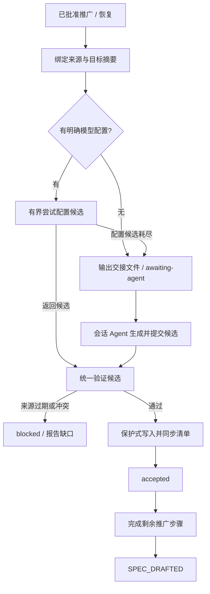

# 需求工件生成与恢复设计

## Context

当前路径为 promoteRequirement → prepareOpenSpecArtifactsShared → openspecgen.Render / Validate / WriteMissing → recommend-routing → CompletePromotion。Render 的内容硬编码，Validate 主要检查结构；newTask 先写入 tasks.md，WriteMissing 又保留已有文件。事后 Skill 修复没有对应的 CLI 完成协议。

现有可复用边界包括 Requirement 的来源摘要与确认记录、AI provider 接口、OpenSpec Artifact 表示和受管清单同步。实现主要落在 internal/commands/task/requirement.go、internal/openspecgen、internal/requirement 及必要的 AI 配置适配层；避免把通用模型调用重写为另一套框架。

## Goals / Non-Goals

**Goals:** 实际需求内容生成、来源可追溯、不同 provider 可替换、无模型可交接、完成判定真实、已有内容安全、同一请求可恢复。

**Non-Goals:** 自动实现、自动批准、语义正确性的形式化证明、全局模型路由改造、历史 Task 批量修复。

## Design Readiness

FD_APPLIED。本次在同一 AIW/OpenSpec Change 内完成受管设计深化：确定统一候选入口、独立生成请求状态、显式模型候选、接续验证和保护式写入。没有创建独立 FD 或实现工作树。

下文是待实现的设计契约，不表示现有命令已经支持它。测试边界已向用户说明：以 promotion / prepare-spec 的共享编排为主要边界，用离线 provider 替身与临时文件验证外部行为；测试执行须后续授权。

## Decisions

### 1. 先持久化上下文，再生成候选

保持 aiw new 的骨架创建职责。promotion / prepare-spec 共享一个生成服务，输入绑定 Requirement ID、批准记录、revision、Task ID、捕获工件实际摘要、已确认片段及修订、相关稳定规格和目标工件基线摘要。

当前会话 Agent 只能提交已确认结论的来源引用；未保存对话不能由 CLI 凭空恢复。会话原文是证据，不自动等于批准事实。已确认的替代关系决定新旧结论优先级；仅凭时间更新不能覆盖批准范围。缺来源、批准上下文变化或同级冲突时报告缺口，停止接受候选。

### 2. 模型只返回候选

复用 provider 接口，使用只读工作区或纯文本请求。候选含 schema_version、request_id、input_digest、artifacts（相对路径与完整内容）、coverage（来源项到文件/要求/场景的引用）及 unresolved 项。每个必要业务要求必须映射到 spec/scenario，工程任务必须映射到范围；design 仅记录已知决定和真实待定工程细节。

禁止模型直接修改生命周期、批准记录或正式文件。capability 来自实际需求和既有规格，支持新增与修改多项能力；采用现有 delta 格式，不固定名称。路径必须限于 proposal.md、design.md、tasks.md 和 specs/<capability>/spec.md，并阻止路径逃逸、符号链接越界及重复目标。

### 2.1 冻结声明式目标清单

批准的 Requirement Plan MUST 明确列出本次 OpenSpec Targets：每项包含稳定的 capability ID 和 `new` 或 `modified` 意图。该段是批准来源的一部分，随来源摘要进入批准记录；候选、模型和会话 Agent 均不得新增、重命名或推测 capability ID。基础目标恒为 `proposal.md`、`design.md` 与 `tasks.md`。每一个声明的 capability 仅对应 `specs/<capability-id>/spec.md`；不允许其他路径、递归目录、删除项或通配模式。

声明语法固定为 `## OpenSpec Targets` 段落，逐行使用 `- capability-id: new` 或 `- capability-id: modified`（ID 可使用反引号）。不从普通正文或候选推断目标；缺失、重复、非法行或大小写冲突均报告错误。新增能力的稳定 spec 也冻结 `absent`，从而检测请求期间第三方新增同名稳定能力；修改能力允许 Change delta 尚不存在，但稳定 spec 必须存在且可读取。

创建 Generation Request 时，CLI 从已批准且摘要匹配的 Targets 建立 Target Manifest，并在 `input.json` 冻结每个目标的相对路径、意图和基线：已有文件记录内容摘要；预期新增文件记录 `absent`。`modified` 必须在相关稳定规格中存在且目标基线可读取；`new` 必须不与已有稳定 capability 或同一 Change 的已声明目标冲突。若批准来源没有有效 Targets、意图与现状不符、或 capability ID 非法，CLI 停止并要求补充/重新批准，不能从候选反向补签。

接续时，候选的每个文件必须恰好属于该 Manifest；每个 Manifest spec 目标必须出现一次，基础目标也必须出现一次。验证重新核对全部 Manifest 基线：`absent` 目标已被第三方创建、已有摘要变化、或候选包含未声明目标时均拒绝接受。与 Manifest 无关的目录变化不扩大本请求写入范围；本请求不需要也不记录完整目录快照。

### 3. 有界、显式的模型 fallback

本 Change 拟新增可选 [ai.artifact_generation] 配置：profiles 为有序的已有命名 Profile 引用列表。未设置列表时，以显式全局 [ai] 配置形成一个候选；没有明确 provider 或只有 auto 时直接交接，不调用通用 auto 探测链。空列表显式选择交接。

按 provider 分别解析 model、endpoint、credentials 和 CLI command；不得跨 provider 携带前一候选的配置。默认值可以由该 provider 自身解析，但结果必须进入请求审计。不得持久化密钥。现有其他 AIW 调用的配置语义不变。

每个去重后的配置候选最多调用一次；有序列表耗尽即交接。不可用、超时或 provider 错误可尝试下一项；可归因于生成结果的 JSON/结构/覆盖错误也可尝试下一项并保留诊断。来源缺失、版本变化、权限或文件冲突不能靠换模型解决，应停止并报告具体原因。恢复不自动重新消费同一请求已耗尽的候选；显式重新生成才建立新的 generation ID。

所有调用绑定取消和有限超时，复用已有 provider 超时能力并在编排边界保证不能无限等待。完整预算和实际失败原因进入生成记录。

### 4. 无模型时交接给会话 Agent

在 .ai/<task-id>/artifacts/spec-generation/<generation-id>/ 记录 input.json、request.md、candidate.json 和 result.json；命名由实现集中管理。`input.json` 中的 Target Manifest 是唯一允许目标的机器可读依据；request.md 用 Easy English 展示同一清单、输入身份、来源正文/引用、输出契约、不得改动的内容、缺口和恢复入口。CLI 输出 request.md 的实际路径、当前状态及下一步。

新增接续入口设计为 aiw requirement prepare-spec <requirement-id> --candidate <path>；它读取候选并进入同一验证/写入流程，不重新运行 promote。现有无 candidate 的 prepare-spec 保留生成/恢复语义。Skill 在已批准范围内生成 candidate.json 后调用此入口；CLI 不声称能自动调用宿主聊天 Agent。

需显式重新生成时采用 prepare-spec 的 --regenerate 选项，以当前来源建立新请求并保留旧请求审计；不得绕过过期批准或扩大范围。Skill 的生成、提交候选属于已批准 promotion 的完成步骤；真实业务冲突仍需用户决定。

### 5. 请求状态与生命周期分离

生成记录使用 prepared、generating、awaiting-agent、validating、applying、accepted、blocked。状态属于该生成请求，不改写 Work Item Attempt、lease 或执行结果。

候选尚未接受时保留同一 Requirement→Task 关联，不调用 CompletePromotion；Task 骨架不应被报告为实现就绪。accepted 后若路由建议不可用，必须输出独立诊断；建议模型不可用不能迫使无模型 fallback 再次依赖 LLM。使用现有可用的确定性路由配置或明确未配置状态，不伪造模型建议。需路由信息的执行阶段仍遵守其既有前置检查。

### 6. 保护已有内容与恢复部分写入

新生成器记录自己创建的路径及内容摘要。对旧模板只接受保守的完整已知模板匹配，包括 newTask 的初始清单；近似匹配或包含人工修改的文件不可直接替换。保护现有人工清单 ID、完成标记与 Core-owned 区域；新增项经受管同步建立映射，不手写运行状态。

对已有人工内容，候选需提供保持其内容的合并结果；无法证明安全时记录冲突。删除过时的生成 spec 仅在来源标记/完整模板匹配和基线摘要同时通过时允许。

写入前预检全部目标，持久化应用清单和原摘要，逐文件原子替换并记录进度；每次替换再核对摘要。恢复只接续原摘要或本请求已写摘要匹配的目标。发现第三方编辑就停止，不回滚覆盖人工修改。所有文件写入与清单同步成功后才 accepted；同步失败可恢复，不能假称完成。

### 7. 质量报告与模型成功分离

结构检查必须包含必需文件及至少一个真实 capability spec。覆盖检查核对当前有效来源、规则、禁止事项、异常与验收映射，并拒绝空壳、已知通用占位及自述生成机制的正文。有效 JSON 或模型自报 coverage 不足以证明覆盖成立；引用必须可解析，引用内容要能支持对应规则。

持久化结构结果、覆盖明细、未解决工程问题和使用的生成方式。语义检查仍有局限，应保留人工审阅入口；不宣称自动检查证明业务完全正确。业务要求缺口阻止接受；明确延期且不妨碍初始规划的工程细节可记录在 TODO/Verification 和 %% 中。SPEC_DRAFTED 不等于 Design Readiness 或实现验收通过。

2.3 的离线检查采用保守的来源原句证据：批准 Plan 在 OpenSpec Targets 外的非标题正文逐行作为必要条目，有效确认片段按原句加入，明确被替代的旧片段移除。每项须保留在映射的要求正文或指定场景中，并与该场景的业务词相关；不以标题、注释、代码块、引用块或相邻场景冒充证据。仅捕获但未确认的其它材料不能作为批准范围。每个场景及编号任务都须有有效映射。覆盖报告标记 `source-statement-preservation-v1`；同义改写缺少原句时保守拒绝，人工审阅仍须检查矛盾、语义及范围，自动通过不证明完整语义正确。报告中的工程就绪和实现验收始终为 `not-assessed`。非阻塞工程问题仅接受 `engineering` 类型，必须在 design 的 %% 及 tasks 的 TODO/Verification 留下记录。各模型尝试保留自身质量报告，Agent 拒绝报告保存在 result.json；这些结果不改变 accepted 或推广生命周期。

## Alternatives Considered

- 只修改 Skill：保留为交互式接续，但纯 CLI 没有可靠执行及完成记录。
- aiw new 强制调用模型：缺少批准来源，且破坏离线骨架创建用途，不采用。
- 使用通用 auto 探测：可能调用未选择的 provider，且共享配置可能不兼容；本功能采用显式候选。
- 模型直接写正式文件：不利于验证、保护和恢复；采用统一候选入口。

## Risks / Trade-offs

- [语义覆盖难以完全自动证明] → 使用来源映射、真实业务 fixture、负例和人工审阅，分别报告证据强度。
- [历史模板与人工内容混合] → 无充分证据不覆盖，保留冲突与人工接续。
- [跨文件写入中断] → 持久化进度与摘要，accepted 作为整体完成标记。
- [批准范围未声明 capability 目标] → 停止创建请求并要求补充后重新批准；不以候选文件名或全目录授权扩大范围。
- [不同模型上下文容量] → 保留必要来源并报告超限；不得静默截断批准规则。
- [会话 Agent 不可用] → awaiting-agent 是可恢复的未完成结果，不自动生成伪内容。

## Testing Decisions

主要测试边界是共享生成编排及其 promotion / prepare-spec 适配，用现有 Artifact、provider 和临时文件系统替身。至少使用订单 CSV 导出与库存低水位提醒两种非 AIW 需求，检查各自字段、权限、异常和验收均落到正确要求/场景；加入遗漏、互换正文、旧修订覆盖新结论等负例。覆盖批准 Targets 中新增/修改多个 capability、未声明 capability、重复目标、`new` 已存在、`modified` 缺失、`absent` 基线被抢先创建及无关目录变化。跨 provider、无模型交接、过期候选、部分写入、已有人工内容、通用 tasks.md 与恢复去重都通过相同入口观察结果。真实模型、网络、CLI 推广真实 Requirement 不属于默认测试。

## Migration Plan

保持已有批准与关联；仅在显式继续该 Requirement 时检查历史工件。没有生成记录的旧 SPEC_DRAFTED 不伪造 accepted 证据，也不批量重置状态；报告内容待复核并通过同一候选机制修复，保留原审批审计。先实现新路径和离线回归，再接续历史模板处理与 Skill 文档。

## Open Questions

%% 实现风险：自动覆盖检查不能证明完整语义正确；上线前需用上述业务 fixture 与故意错误候选验证拒绝能力，报告人工审阅边界。
